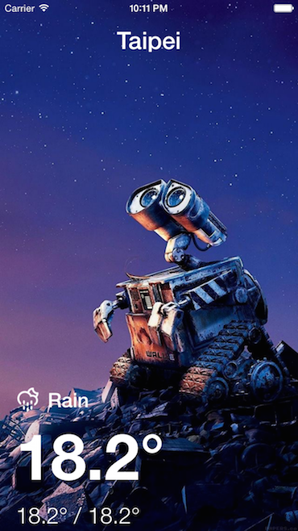
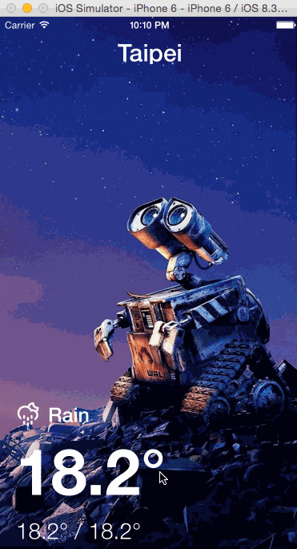

Simple Swift Weather App
====================
A very simple weather iOS app written by Swift language. Inspired by these wonderful iOS programming tutorials: 

1. [iOS 7 Best Practices; A Weather App Case Study: Part 1/2] (http://www.raywenderlich.com/55384/ios-7-best-practices-part-1)
2. [iOS 7 Best Practices; A Weather App Case Study: Part 2/2] (http://www.raywenderlich.com/55386/ios-7-best-practices-part-2)

Development Environment
-----------------------
- Xcode 6.3
- Swift 1.2

Screenshot
----------

Wallpaper Source
-------------------
- [FreeiOS8.com - ag66-wall-e-disney-want-go-home-art](http://freeios8.com/ag66-wall-e-disney-want-go-home-art/) 

Walkthrough
-----------

GIF created with [LiceCap](http://www.cockos.com/licecap/).

